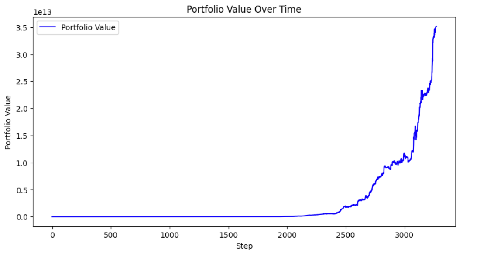

# Reinforcement Learning Trading Bot

This project implements a cryptocurrency trading bot using a Deep Q-Network (DQN), a reinforcement learning algorithm. The bot is trained on historical price data and learns to make trading decisions to maximize its profit.

## Features

*   Fetches historical cryptocurrency data from the Bitfinex API.
*   Calculates various technical indicators (SMA, EMA, RSI, MACD, Bollinger Bands, OBV) to be used as features for the model.
*   Splits the data into training and testing sets.
*   Trains a DQN model using the `stable-baselines3` library.
*   Evaluates the trained model's performance on the test set.
*   Visualizes the bot's performance with interactive plots.

## Technologies Used

*   Python
*   Jupyter Notebook
*   Pandas
*   NumPy
*   Scikit-learn
*   TensorFlow
*   Plotly
*   Stable-Baselines3
*   Gym

## Installation and Usage

1.  **Clone the repository:**
    ```bash
    git clone https://github.com/your-username/rl-trading-bot.git
    ```
2.  **Install the dependencies:**
    ```bash
    pip install -r requirements.txt
    ```
3.  **Run the Jupyter Notebook:**
    ```bash
    jupyter notebook get_market_data.ipynb
    ```

## Results

The trading bot's performance is evaluated on the test set. On a portion of the test data, the bot achieved the following result:

*   **Market Return:** 15.38%
*   **Portfolio Return:** 5.80%


*Caption: The plot above shows the portfolio value of the agent during one of the training runs. The extreme returns are a clear indicator of overfitting, as the model has essentially memorized the training data.*

### Analysis and Future Work

The model demonstrates an extremely high, unrealistic return on the training data, as seen in the plot above. However, the performance on the test set is significantly lower (a 5.80% portfolio return compared to a 15.38% market return). This stark contrast confirms that the model is **overfitting** to the training data and does not generalize well to new, unseen data.

The "crazy returns" observed during training are a direct result of this overfitting. The model has essentially "memorized" the optimal trades for the historical data it was trained on, a common pitfall in financial modeling.

To improve the model's generalization and create a more robust trading bot, the following steps could be taken:

*   **Regularization:** Introduce regularization techniques like L1/L2 regularization or dropout to the neural network to prevent it from becoming too complex.
*   **More Data:** Train the model on a larger and more diverse dataset, potentially including different market conditions.
*   **Feature Selection:** Experiment with different combinations of technical indicators to find the most predictive features.
*   **Hyperparameter Tuning:** Optimize the DQN's hyperparameters (e.g., learning rate, discount factor, exploration-exploitation schedule) using techniques like grid search or Bayesian optimization.
*   **Walk-Forward Validation:** Implement a more robust backtesting strategy like walk-forward validation to get a more realistic estimate of the model's performance on unseen data.